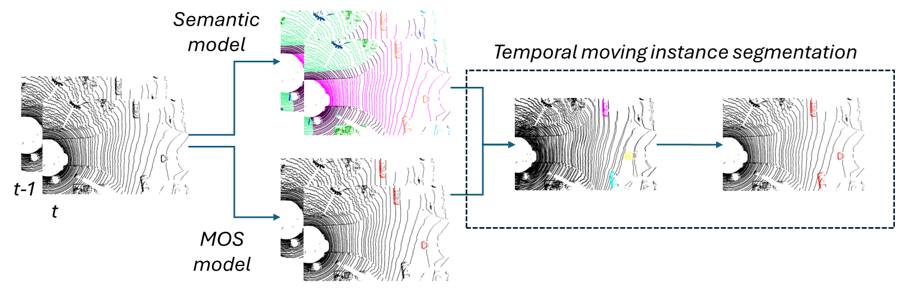

# 2DPASS-MOS

2DPASS-MOS is a mapless Moving Object Segmentation (MOS) method based on [2DPASS](https://github.com/yanx27/2DPASS).
It operates on 3D LiDAR point clouds, but instead of semantic segmentation, this method decomposes the scene into static and dynamic objects using multimodal learning with single-modal inference.
This is the first work successfully fusing camera and LIDAR data in training to enhance the LiDAR-only inference for LIDAR MOS.
The network takes advantage of the features of 2D images during training, such as dense color information and fine-grained texture, to provide additional information to the LiDAR scans,
but during inference, the network performs segmentation on the clean LiDAR point clouds even in the absence of a map and the camera modality.
We evaluate our approach on the SemanticKITTI and Apollo datasets, achieve state-of-the-art performance on moving object segmentation by utilizing only a few (even one) LIDAR frames, without any map building or even poses.

Using just one scan already achieves remarkable results, but this method provides the possibility to use multiple LiDAR point clouds for both training and inference to extract additional moving information.
One sweep-based MOS (without direct motion features) can be learned by interpretating the environment, but We improve the state-of-the-art by adapting a multi-modal learning scheme and extending it by multi-frame instance segmentation.
To create the multi-scan version of the network, the solution provided by the [4DMOS](https://github.com/PRBonn/4DMOS) was a great help during the implementation.
We propose semantic information usage for multi-frame instance segmentation in order to enhance the performance measures.
Our method can benefit from the semantic information without restricting categories by applying instance segmentation only as a refinement step.

We want to thank the original authors for their clear implementation and excellent work, which has greatly helped our project.

<p align="center">
    
</p>

## How it works

The model processes the LiDAR point clouds, which are then passed through two distinct paths. On one side, the data is fed into a moving object detection model, which leverages information from multiple frames simultaneously to generate more accurate predictions by capturing temporal dynamics. This enables the model to detect moving objects more accurately by considering their movement over time. In parallel, the point clouds are also passed through a semantic branch, where only a single scan is utilized to generate a detailed semantic prediction, classifying various elements in the scene. By combining the outputs from both the moving object detection and semantic segmentation branches, the network refines the detection of moving objects. It enhances the predictions by incorporating semantic information, which helps recover any missing points and provides more complete and reliable object segmentation.

<p align="center">
    
</p>

## Installation

- Download the original [2DPASS](https://github.com/yanx27/2DPASS) then modify it as described in the adaptation section.
- The dependencies will be the same as for the original [2DPASS](https://github.com/yanx27/2DPASS#requirements).
- The models were run on the [SemanticKITTI](http://www.semantic-kitti.org/index.html) dataset.

### Data Preparation

As with 2DPASS, you need to download the files from the [SemanticKITTI website](http://semantic-kitti.org/dataset.html) and the color data from the [Kitti Odometry website](http://www.cvlibs.net/datasets/kitti/eval_odometry.php) and extract them into a folder.

```
./dataset/
  ├── ...
  └── dataset-1f/
      └── sequences/
          ├── 00/ # 00-10 for training       
          │   ├── velodyne/	
          |   |	├── 000000.bin
          |   |	├── 000001.bin
          |   |	└── ...
          │   ├── labels/ 
          |   |   ├── 000000.label
          |   |   ├── 000001.label
          |   |   └── ...
          |   ├── image_2/ 
          |   |   ├── 000000.png
          |   |   ├── 000001.png
          |   |   └── ...
          |   ├── calib.txt
          |   └── poses.txt # for multiple frames
          ├── ...
          ├── 08/ # for validation
          ├── ...
          ├── 11/ # 11-21 for testing
          ├── ...
          └── 21/
```

### MOS adaptation

The files, including the necessary config files and additional code for the MOS model to function, need to be merged into the 2DPASS folder. 
The repository also includes bash scripts to simplify the execution process. Detailed instructions can be found in the "Run" section.

## Run

Scripts have been created to simplify testing and running the code. Each script prompts the user to input various parameters and stores the responses, making it easier to repeat identical runs in the future. 

### Pre-process

The first step is to run the "00_gen_n-frame_dataset.sh" script, which generates a pre-processed dataset. This is necessary for running the multi-frame version. 
It is recommended to create the generated dataset in the dataset folder, for example, under the name "dataset-2f" (where 2f indicates 2 frames).

```
./dataset/
├── ...
├── dataset-1f/
└── dataset-2f/
```

```shell script
./00_gen_n-frame_dataset.sh
```

- **Enter the original dataset path:** _Location of the original SemanticKITTI dataset_
- **Enter the output dataset path:** _Loction of the new merged dataset_
- **Enter merge size:** _How many scans should be concatenated_
- **Enter dataset type [train, val, test, all]:** _Which part of the dataset should be merged_

### Training

To train a 2DPASS-MOS network, you can run the training with the "01_run_2dpass-mos_train.sh" script.

```shell script
./01_run_2dpass-mos_train.sh
```

- **Enter the config path:** _Location of the config file_
<br/> - config/2DPASS-semantickitti-mos-1f.yaml for 1 frame
<br/> - config/2DPASS-semantickitti-mos-2f.yaml for 2 frame
<br/> - config/2DPASS-semantickitti.yaml for semantic segmentation
- **Enter the log directory name:** _Name of the log folder_
<br/> - path: logs/SemanticKITTI/<log_dir_name>

### Testing

By running the "02_run_2dpass-mos_test.sh" script, users can test the model. This script provides the option to save results from either the validation dataset or the test dataset to upload the result.

```shell script
./02_run_2dpass-mos_test.sh
```

- **Enter the config path:** _Location of the config file_
<br/> - config/2DPASS-semantickitti-mos-1f.yaml for 1 frame
<br/> - config/2DPASS-semantickitti-mos-2f.yaml for 2 frame
<br/> - config/2DPASS-semantickitti.yaml for semantic segmentation

- **Enter the model path:** _Location of the checkpoint_
<br/> - models/model_2dpass-mos_frames-1_batch-8_epoch-64.ckpt for 1 frame pretrain model 
<br/> - models/model_2dpass-mos_frames-2_batch-4_epoch-64.ckpt for 2 frame pretrain model 
<br/> - models/model_2dpass-original.ckpt for semantic pretrain model
<br/> - Your own trained models probablly in the logs folder
<br/> (Link for the pretrain models in the Results section)

- **Enter the TTA number:** _Number of views for the test-time-augmentation_
<br/> - We set this value to 12 as default, and if you use other GPUs with smaller memory, you can choose a smaller value.
<br/> - 1 denotes there is no TTA used.

- **Enter dataset type [val, test]:** _Type of the dataset_
<br/> - Select val if you want to save the val predictions to show results
<br/> - Select test if you want to save the test predictions to submit to server

### Post-process

If a multi-frame version was used, it is necessary to run the "03_run_2dpass-mos_clear_2frame-only.sh" script to ensure that the predictions are in the correct format.

```shell script
./03_run_2dpass-mos_clear_2frame-only.sh
```

- **Enter predictions path:** _Location of the concatenated predictions_
- **Enter data path:** _Loction of the concatenated dataset_
- **Enter save location path (and a folder name):** _Location of the cleard predictions_
<br/> - Example: output/pred_2dpass-mos_val_1frame-12tta
- **Enter dataset type [val, test]:** _Type of the predictions_

To further improve the results, there is an "04_run_add-semantic.sh" script available. This script utilizes additional semantic segmentation information to create object instances and make object-level decisions for the predictions.

```shell script
./04_run_add-semantic.sh
```

- **Enter dataset type [valid, test]:** _Type of the predictions_
- **Enter the dataset path:** _Location of the original SemanticKITTI dataset_
- **Enter the MOS prediction path:** _Location of the 2DPASS-MOS (cleard) predictions_
- **Enter the Semantic prediction path:** _Location of the 2DPASS predictions_
- **Enter the Output prediction path:** _Loction of the improved predictions_
- **Enter the Frame Number:** _How many frames should be concatenated_

### Evaluation

Finally, to standardize the results, you can run the "05_run_2dpass-mos_evaulate.sh" script.

```shell script
./05_run_2dpass-mos_evaulate.sh
```
- **Enter the dataset path:** _Location of the original SemanticKITTI dataset_
- **Enter the prediction path:** _Location of the final MOS predictions_
- **Enter dataset type [valid, test]:** _Type of the predictions_

## Results

In this section, we provide a comprehensive analysis of model performance on two key datasets: SemanticKITTI and Apollo. The results are organized into multiple comparisons and an ablation study to highlight the influence of various components and approaches.

For further reference, the models used to obtain these results can be accessed [here](https://drive.google.com/drive/folders/1rVil2iY6qmEFc0mDci62nVAH9OEyHC7d), and some of the listed predictions can be found [here](https://drive.google.com/drive/folders/1b58vPDAaxa__CFPl-ZMCROcOilxb6J9E).

#### SemanticKITTI - Comparison

The first table presents a comparison of different models evaluated on the SemanticKITTI dataset, categorized into three distinct groups:

- Models that **do not utilize ego-poses.**
- Models that **utilize ego-poses with 2 frames in real time.**
- Models that **utilize ego-poses with multiple frames (n frames).**

<table>
  <tr>
    <th>Method</th>
    <th>Frames</th>
    <th>mIoU (validation)</th>
  </tr>
  <tr>
    <td>MInet</td>
    <td>1</td>
    <td>36.9%</td>
  </tr>
  <tr>
    <td>Rangenet++</td>
    <td>1</td>
    <td>39.5%</td>
  </tr>
  <tr>
    <td>4DMOS</td>
    <td>5</td>
    <td>39.9%</td>
  </tr>
  <tr>
    <td>LMNet</td>
    <td>1</td>
    <td>51.9%</td>
  </tr>
  <tr>
    <td>SalsaNext</td>
    <td>1</td>
    <td>53.4%</td>
  </tr>
  <tr>
    <td><b>2DPASS-MOS (TTA=2, K=1)</b></td>
    <td><b>1</b></td>
    <td><b>64.1%</b></td>
  </tr>
  <tr>
    <td><b>2DPASS-MOS (TTA=12, K=1)</b></td>
    <td><b>1</b></td>
    <td><b>66.0%</b></td>
  </tr>
  <tr>
    <td colspan="3"></td> <!-- Empty merged row -->
  </tr>
  <tr>
    <td>LMNet</td>
    <td>2</td>
    <td>56.0%</td>
  </tr>
  <tr>
    <td>LMNet (Residuals)</td>
    <td>2</td>
    <td>59.9%</td>
  </tr>
  <tr>
    <td>4DMOS</td>
    <td>2</td>
    <td>69.0%</td>
  </tr>
  <tr>
    <td><b>2DPASS-MOS (TTA=1, K=2)</b></td>
    <td><b>2</b></td>
    <td><b>71.8%</b></td>
  </tr>
  <tr>
    <td colspan="3"></td> <!-- Empty merged row -->
  </tr>
  <tr>
    <td>InsMOS</td>
    <td>5</td>
    <td>60.8%</td>
  </tr>
  <tr>
    <td>LMNet (Semantics)</td>
    <td>9</td>
    <td>67.1%</td>
  </tr>
  <tr>
    <td>RVMOS</td>
    <td>6</td>
    <td>71.2%</td>
  </tr>
  <tr>
    <td>Motionseg3D</td>
    <td>8</td>
    <td>71.4%</td>
  </tr>
  <tr>
    <td>4DMOS</td>
    <td>10</td>
    <td>71.9%</td>
  </tr>
  <tr>
    <td>InsMOS</td>
    <td>10</td>
    <td>73.2%</td>
  </tr>
  <tr>
    <td><b>2DPASS-MOS (TTA=12, K=2)</b></td>
    <td><b>2</b></td>
    <td><b>74.9%</b></td>
  </tr>
  <tr>
    <td>MF-MOS</td>
    <td>8</td>
    <td>76.1%</td>
  </tr>
  <tr>
    <td><b>2DPASS-MOS (TTA=12, K=10)</b></td>
    <td><b>2</b></td>
    <td><b>77.8%</b></td>
  </tr>
</table>


#### SemanticKITTI - Ablation study

The second table presents an ablation study on the SemanticKITTI validation dataset. This study examines the impact of various system components on model accuracy, providing insight into the contributions of specific features and techniques.

|Frames|Semantics|mIoU (validation)|
|:---:|:---:|:---:|
|1|0|65.6%|
|1|1|66.0%|
|2|0|73.2%|
|2|1|73.6%|
|2|2|74.9%|
|2|10|77.8%|

#### Apollo - Comparison

The final table offers a comparison of different models' accuracies on the Apollo dataset. This analysis further validates the performance of the models across different datasets and driving environments.

|Method|Frames|mIoU (validation)|
|:---:|:---:|:---:|
|LMNet|9|16.9|
|LMNet (fine-tuned)|9|65.9|
|MF-MOS|8|49.9|
|MF-MOS (fine-tuned)|8|70.7|
|4DMOS|10|73.1|
|InsMOS|10|78.0|
|2DPASS-MOS|2|80.6|

## License
This repository is released under MIT License (see LICENSE file for details).
